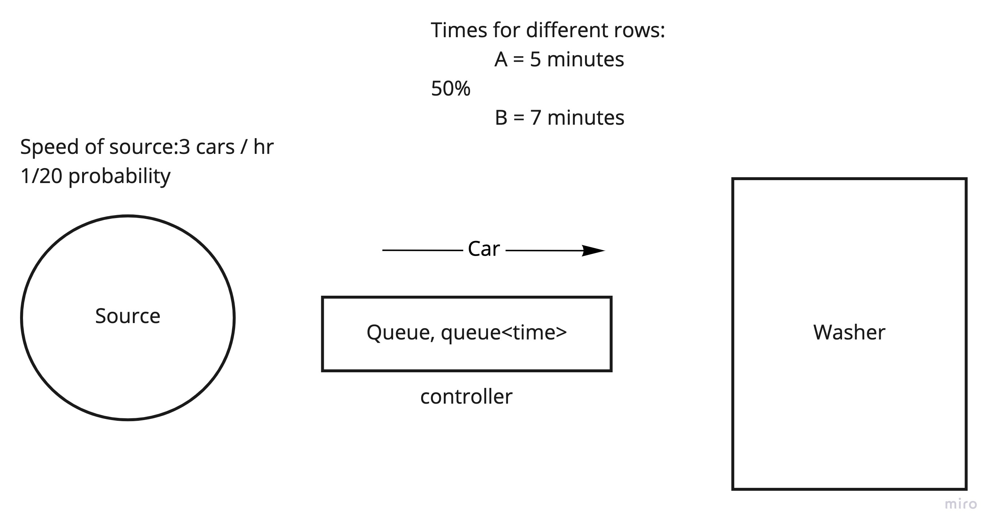
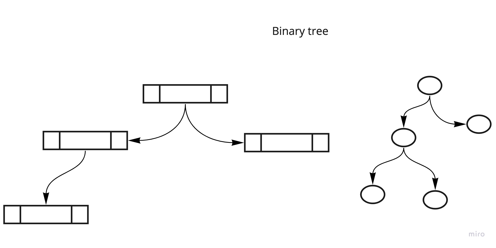
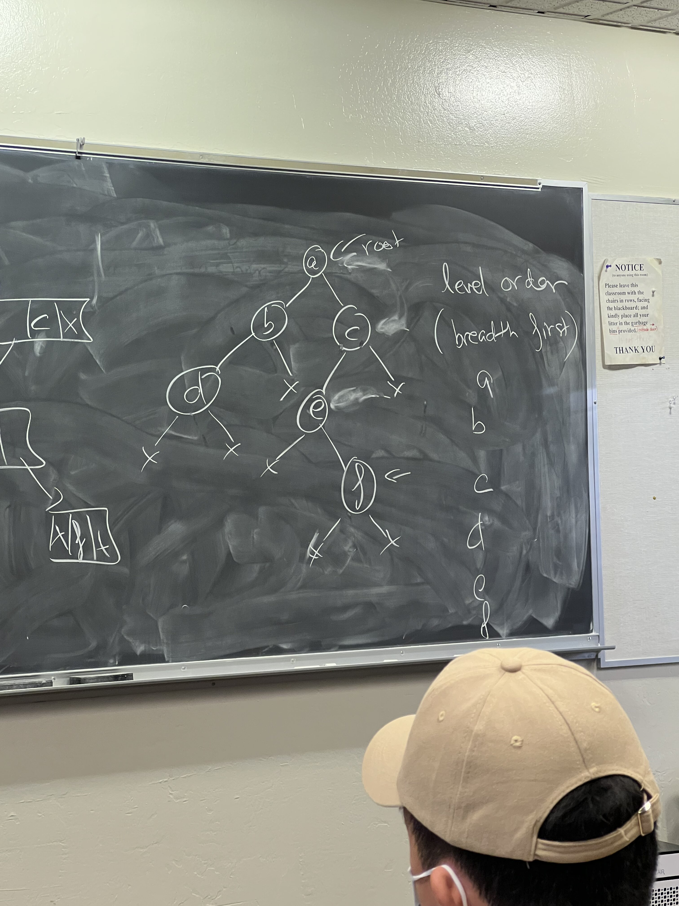
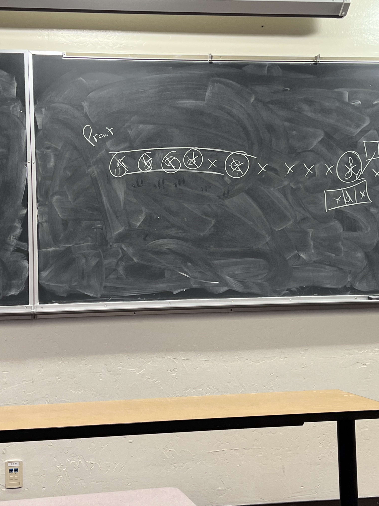

## Car wash problem

### Problem statement:
There is a washer and a queue. The task is to make all people happy and every car clean.

There are two types of lines in carwash depending on duration:

wash A - 5 minutes 

wash B - 7 minutes

50% of chosing A and 50% of chosing B

Washer can do 3 cars / hr, so the probability of car being produced by source is 1/20 = 0.05

## Traversing binary tree

Traverse binary tree by level order (breadth first). So we traverse all childs on one level.

We can traverse the tree using queue. Push to queue childs every time we hit parent.

We go one level by level. When we encounter parent node, we put it in the queue.

