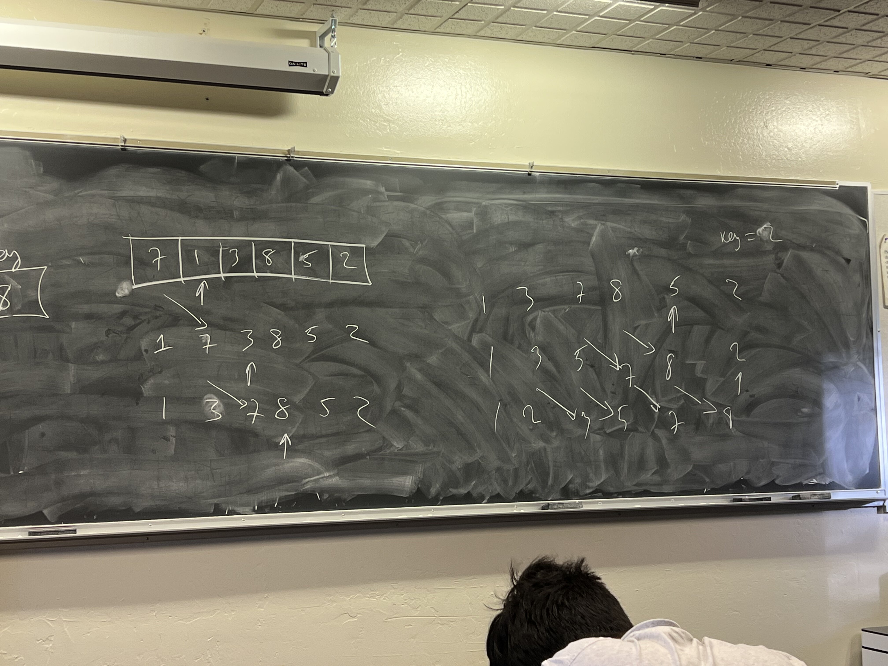

## Quadratic sorts

### Greedy - Selection sort

    Repeat for N times:
    Find smallest
    Change with current i
### Insertion sort
    Each time we compare key with left part
    If it is less we move it.

### Random sort - Naive sort
    Just run randomly O(N!)