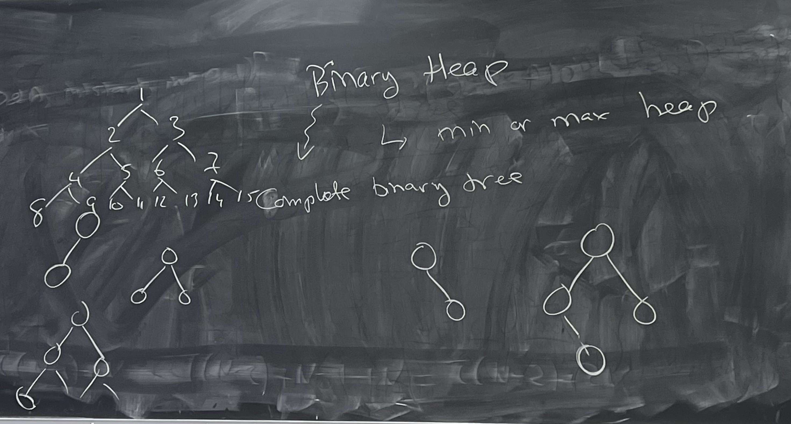
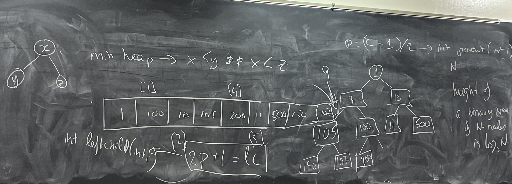

## Quick sort
In merge sort we divide list in the middle every time.

In quick sort we divide list not in the middle every time. But instead we choose pivot and swaping values on right and left.

**runtime of the algorithm**: T(N) = 2T(N/2) + O(N) = O(NlogN)

In worst scenario when all elements are sorted already algorithm will work for O(N^2) because we partition N times.

**runtime of the algorithm for the worst scenario**: T(N) = T(N-1) + O(N) = T(N-1) + N = T(N-2) + N - 1 + N = T(N-2) + 2N

we call this N times, so T(N) = N^2

So, sometimes people use another algorithm when there are less then 10 elements or so. For example, insertionsort.

**how to do partiotion**

1. Take the median (can be good case, because some of the elements are already to the left of the median, and some of them to the rigth)
2. Take the first element (can be bad, if sub-array is sorted)
3. Take the random element 
4. Take 3/5/7 random elements and then choose median from them (best case)

## Binary Heap

Could be min or max

Binary Heap - Complete binary tree. We are goin top-down-left-rigth.

When we add value to a tree we should contain the structure of the heap. So we swap parent and child until we meet the condition for min/max heap.

Code: https://github.com/alexvishnevskiy/CSCI_61/tree/master/week03/seminar02