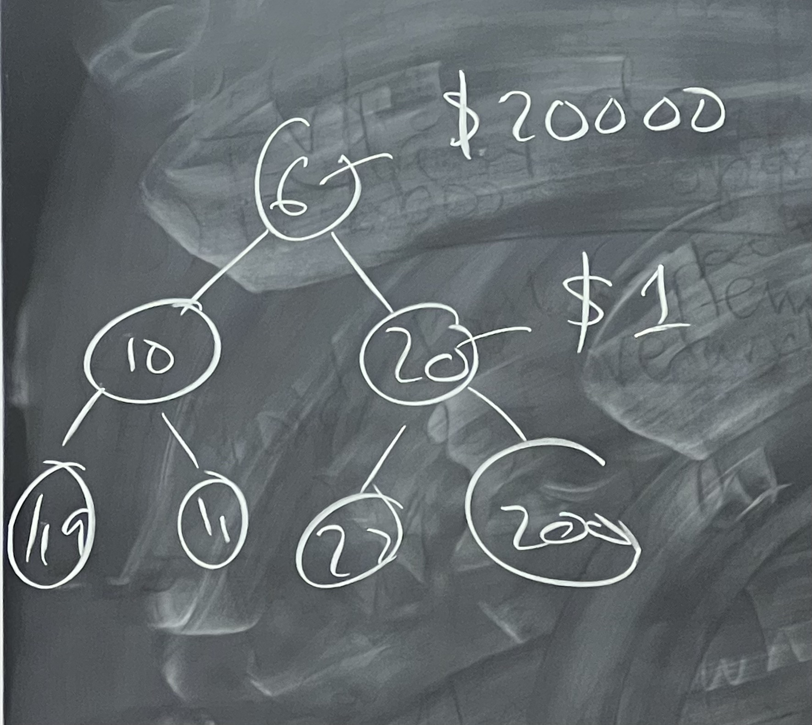

## Heap

We use array to represent complete binary tree because therefore we use array efficiently. If we use non complete binary tree, there will be a lot of unused lots.

In the realization, we can add priorities to our queue as well as data.

**How to build a heap un a linear time?**

https://youtu.be/MiyLo8adrWw