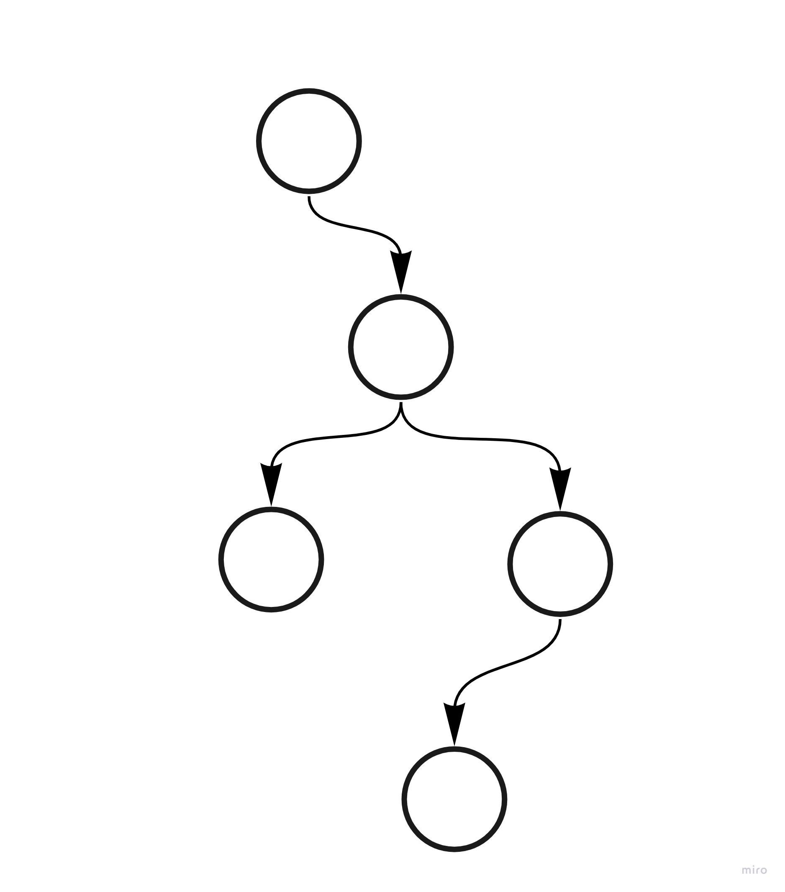
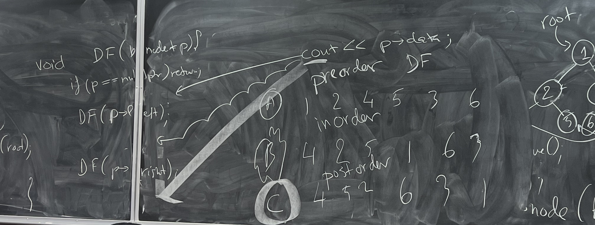
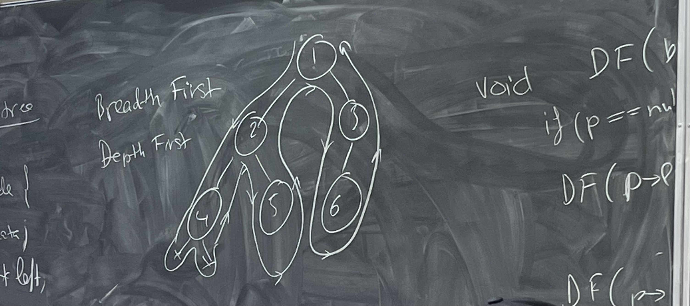
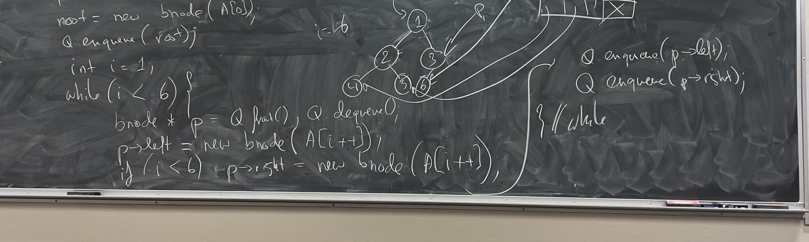

## Binary tree

How to represent the tree using bnode clas?

    bnode * root;
    root = new node('a', nullptr, new bnode('c', new node('d'), new bnode('f', new bnode('g'))))

There are two algorithms to traverse a tree:

1) Breadth first
2) Depth first

Variants of depth first traversals: preorder, inorder, postorder

How can we traverse a tree?

How to make a tree from an array?
