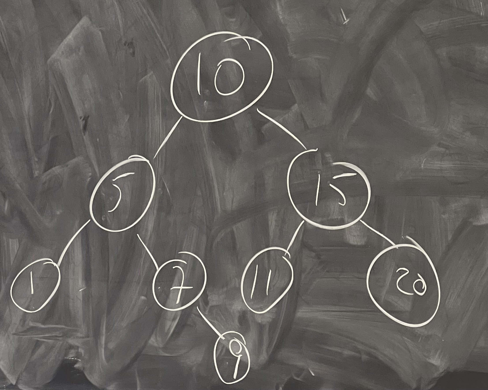

## Binary Search Tree

### How it looks?
Basically the tree with a property of binary search. It is better to use binary search tree if we want to search for values and also insert.

### Properties
* largest value in the last subtree < value in node < smallest value in the right subtree

Code: https://github.com/alexvishnevskiy/CSCI_61/tree/master/week08/seminar01