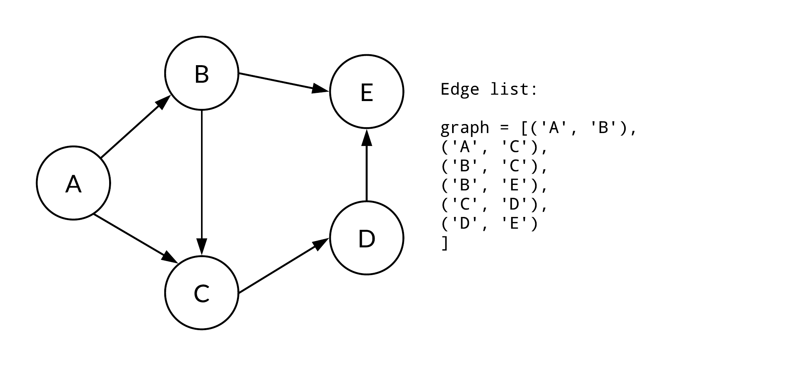

## Graphs

### Types of graphs

Undirected graph

Directed graph

### Graph terminology

**Loops**. A loop is an edge that connects a vertex to itself.

**Path**. A path in a graph is a sequence of vertices, p_0, ...p_n such that each adjacent pair of vertices p_i, p_{i+1} are connected by an edge.

**Multiple edges**. A graph that has two or more edges connected to the same two veertices in the same direction.

**Simple graph**. The graph that has no loops and multiple edges.

### Graph implementations

#### **Adjacency matrix**

Each component of the adjacency matrix indicates whether a certain edge is present.
#### **Edge lists**

We can represent a graph using a linked list for each vertex.

#### **Edge sets**

We can represent a graph using set for each vertex.

### Which representation is best?

If the space is available, then an adjacency matrix is easier to implement and generally easier to use than edge lists or edge sets. But sometimes you should consider:

1. Adding or removing edges
2. Checking whether a particular edge is present
3. Iterating a loop that executes one time for each edge with a particular source vertex i

The first two operations require only a small constant amount of time with the adjacency matrices. But in the worst case, both 1 and 2 require O(N) operations with the edge list representations (N is the number of vertices). This worst case occurs when the operation must traverse an entire list. With edge sets both operations 1 and 2 takes either O(1)-O(N) for unordered_set or O(logN) for set.

On the other hand, the third operation is efficient for edge list and edge set, because it takes O(e), where e is the number of edges that have vertex i. But with an adjacency matrix, the third operation requires O(N), because it should traverse the entire row.

Also, if each vertex has only a few edges(sparse graph), then an adjacency matrix is mostly wasted space with the value false.