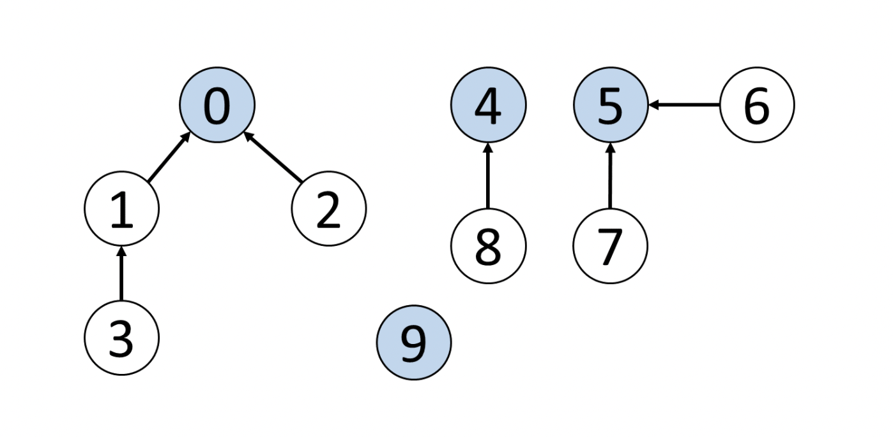
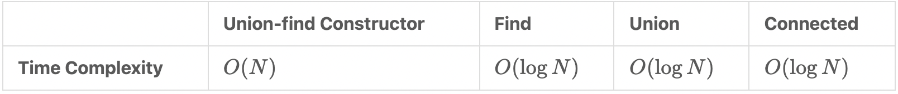
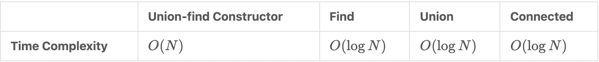
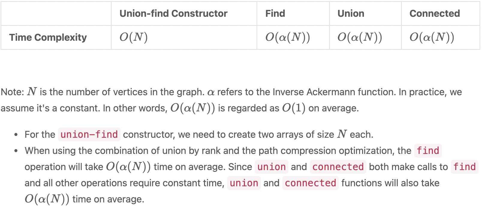

## Disjoint Set

### Overview

Given the vertices and edges between them, how could we quickly check whether two vertices are connected? For example, Figure 5 shows the edges between vertices, so how can we efficiently check if 0 is connected to 3, 1 is connected to 5, or 7 is connected to 8? We can do so by using the “disjoint set” data structure, also known as the “union-find” data structure.

The primary use of disjoint sets is to address the connectivity between the components of a network. The “network“ here can be a computer network or a social network. For instance, we can use a disjoint set to determine if two people share a common ancestor.

### Terminology

* Parent node: the direct parent node of a vertex. For example, in Figure 5, the parent node of vertex 3 is 1, the parent node of vertex 2 is 0, and the parent node of vertex 9 is 9.
* Root node: a node without a parent node; it can be viewed as the parent node of itself. For example, in Figure 5, the root node of vertices 3 and 2 is 0. As for 0, it is its own root node and parent node. Likewise, the root node and parent node of vertex 9 is 9 itself. Sometimes the root node is referred to as the head node.

### The two important functions of "disjoint set"

* **The find function** finds the root node of a given vertex. For example, in Figure , the output of the find function for vertex 3 is 0.
* **The union function** unions two vertices and makes their root nodes the same. In Figure, if we union vertex 4 and vertex 5, their root node will become the same, which means the union function will modify the root node of vertex 4 or vertex 5 to the same root node.

### There are two ways to implement a “disjoint set”.

* Implementation with **Quick Find**: in this case, the time complexity of the find function will be O(1)O(1). However, the union function will take more time with the time complexity of O(N)O(N).
* Implementation with **Quick Union**: compared with the Quick Find implementation, the time complexity of the union function is better. Meanwhile, the find function will take more time in this case.

### Different types of "disjoint sets".

* Quick find

* Quick union

* Union by rank

To be specific, the “rank” refers to the height of each vertex. When we union two vertices, instead of always picking the root of x (or y, it doesn't matter as long as we're consistent) as the new root node, we choose the root node of the vertex with a larger “rank”. We will merge the shorter tree under the taller tree and assign the root node of the taller tree as the root node for both vertices. In this way, we effectively avoid the possibility of connecting all vertices into a straight line. This optimization is called the “disjoint set” with union by rank.

* Path compession optimization

In the previous implementation of the “disjoint set”, notice that to find the root node, we need to traverse the parent nodes sequentially until we reach the root node. If we search the root node of the same element again, we repeat the same operations. Is there any way to optimize this process?

The answer is yes! After finding the root node, we can update the parent node of all traversed elements to their root node. When we search for the root node of the same element again, we only need to traverse two elements to find its root node, which is highly efficient. So, how could we efficiently update the parent nodes of all traversed elements to the root node? The answer is to use “recursion”. This optimization is called “path compression”, which optimizes the find function.

* Optimized "disjoint set"

Implementation of the “disjoint set” is optimized with both “path compression” and “union by rank”.

Code: https://github.com/alexvishnevskiy/CSCI_61/tree/master/week08/seminar03