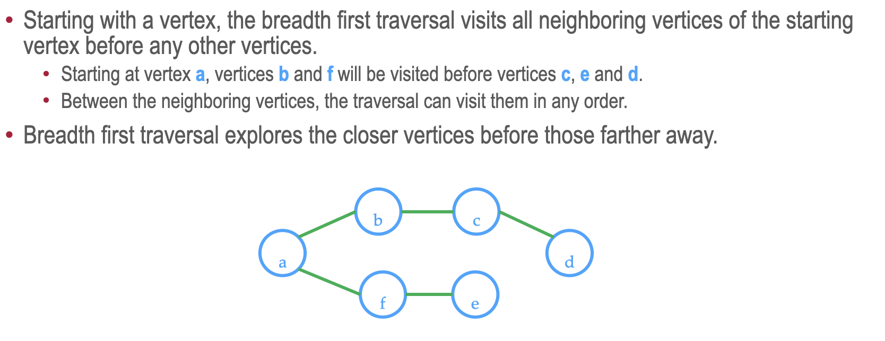
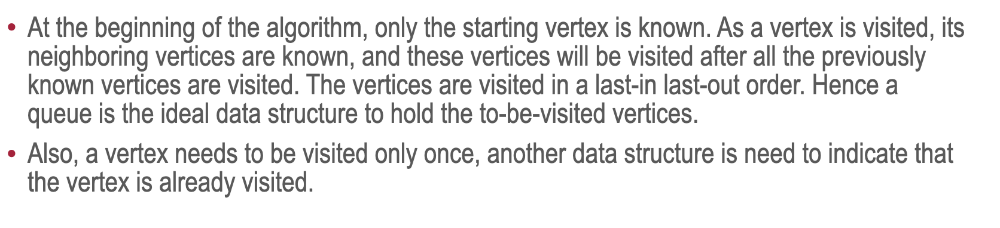
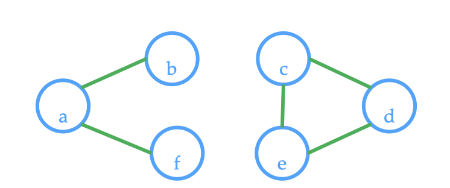

## Breadth first algorithms

### Graph treversal

* Graph traversal is an algorithm of visiting all the vertices in the graph
* The order of visitation is determined by the algorithm and there are two basic algorithms (like in trees):
1) Breadth first - traverse one step in height each time
2) Depth first - traverse till the end

### Breadth first traversal

### Determine the number of connected component

To determine the number of connected component, count the number of unvisited vertices that the connected component algorithm can be executed with. In other word, for every vertex in the graph, if we encounter the vertex that hasn't been visited we increase our counter. In the example below, if we start from vertex a, nodes b, f will be visited. But when we go to vertex c or d or e, we increase the counter, because they haven't been visited yet -> there are two connected components.

