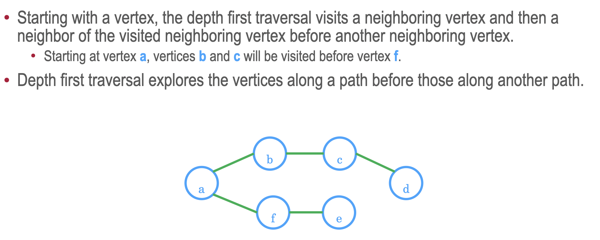
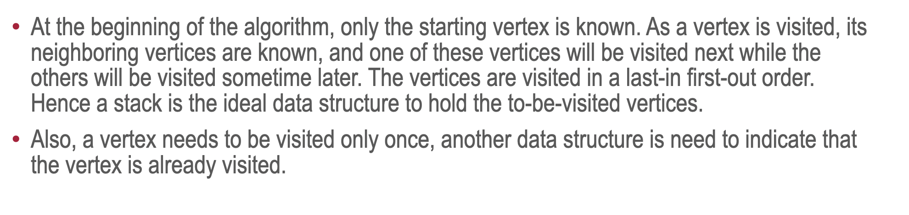

## Depth first algorithms

### Graph treversal

* Graph traversal is an algorithm of visiting all the vertices in the graph
* The order of visitation is determined by the algorithm and there are two basic algorithms (like in trees):
1) Breadth first - traverse one step in height each time
2) Depth first - traverse till the end

### Depth first traversal

